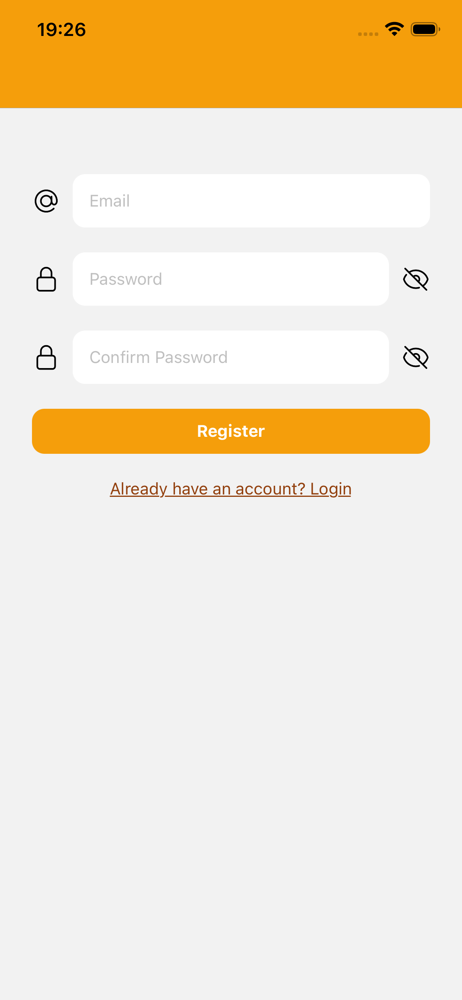
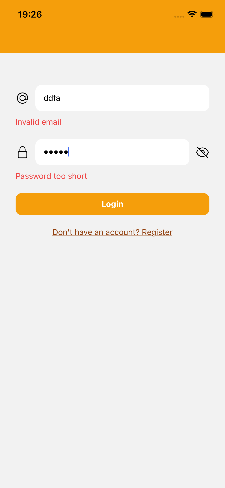
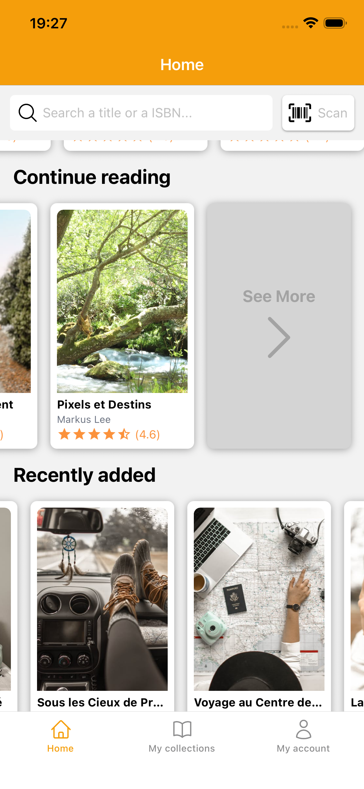

# BookNook 📚

BookNook is a mobile application that allows you to easily browse your book collections and discover new titles.

⚠️ **Ongoing project** – new features will be added progressively.

---

## Current Features

- **Authentication page**: login and register UI with route guarding, currently no backend integration
- **Home Page**: scrollable book collections

---

## Upcoming Features

- [ ] Book detail view (description, author, ratings, etc.)
- [ ] Personal collection management
- [ ] Book search and filtering
- [ ] Favorites and recommendations system
- [ ] Backend integration for authentication and data storage

---

## Technologies

- React Native + Expo
- Expo Router for navigation
- Tailwind / NativeWind for styling
- Zod for form validation
- Planning: NextJS / Drizzle / PostgreSQL

---

## Screenshots

### Authentication

Login / Register page:  

Login page with validation errors:  

### Home Page

Home page at first load:  

Scrolling home page (down & sideways):  

---

## License

MIT License
