# BookNook 📚

BookNook is a mobile application that helps you manage your personal library, discover new books, and track your reading.  
The app combines scanning, search, and AI-powered recommendations to provide a seamless reading experience.

⚠️ **Ongoing project** – new features are actively being added.

---

## Features

### Library & Collections

- Keep track of your personal library and wishlist
- Add new books by scanning ISBN codes with your device camera
- Search for books and view their details, including cover, authors, description and more

### Book Discovery & Recommendations

- Receive personalized book suggestions powered by AI
- Explore recommended books directly from your home page

### Account & Navigation

- Create an account and manage your profile
- Navigate easily between library, wishlist, recommendations, and book pages

### User Experience

- Smooth and responsive interface
- Quick search inputs for fast access to books
- Clean layout with clear feedback for actions like adding books

---

## Upcoming Features

- [ ] Rate books and track your reading progress
- [ ] Record your reading status (pages read, timing)
- [ ] View stats and take on reading challenges
- [ ] Import your book data from other websites
- [ ] Organize books in custom categories or folders
- [ ] Improved AI recommendations

---

## Technologies

- **Frontend**: React Native + Expo
- **Backend**: Next.js on Vercel
- **Database**: Supabase
- **Routing**: Expo Router
- **Validation**: Zod
- **UI Styling**: Nativewind
- **APIs**: Google Books API, OpenAI API

---

## Screenshots

### Authentication

Login page  
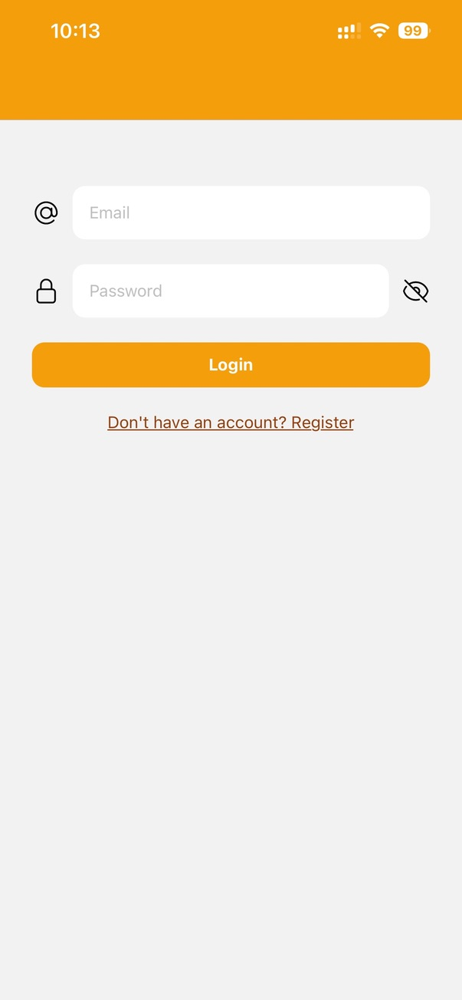
Register page  
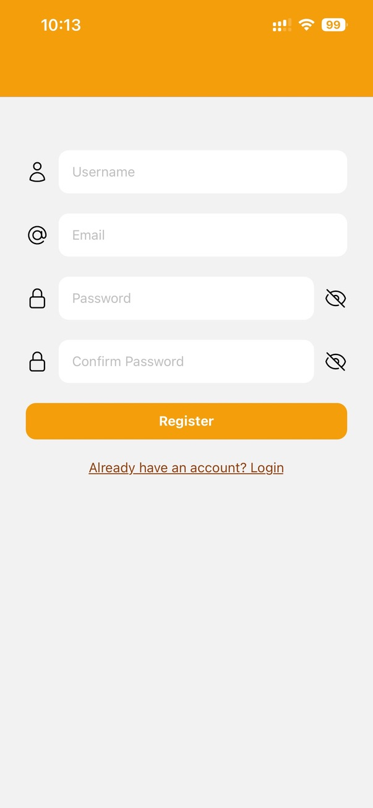

### Account

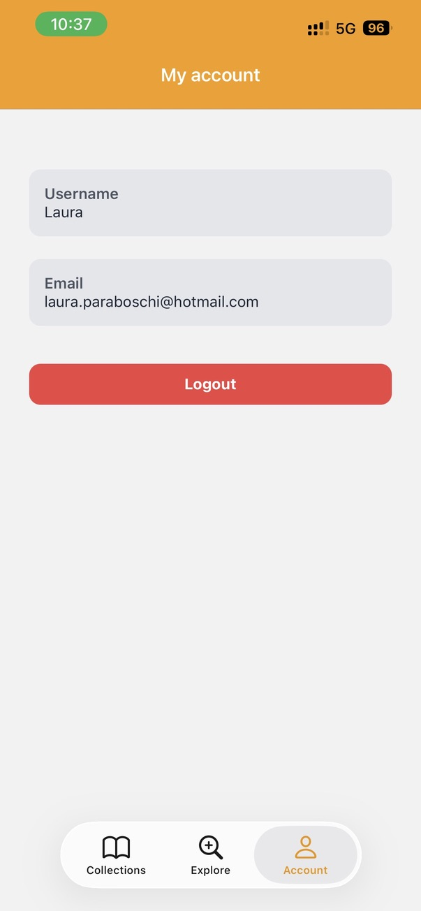

### Library & Wishlist

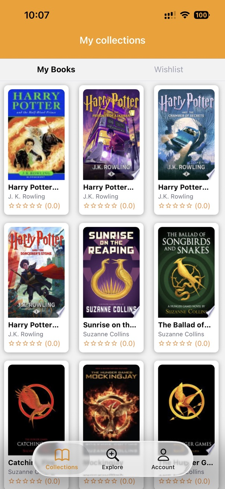  
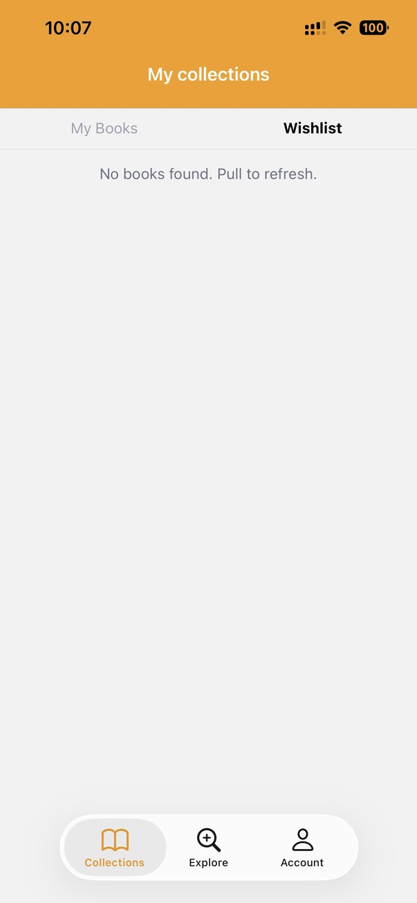

### Home & Recommendations

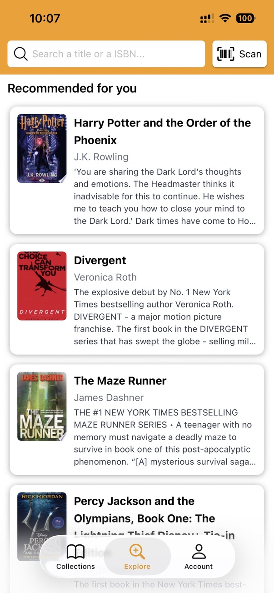

### Search Inputs on Home

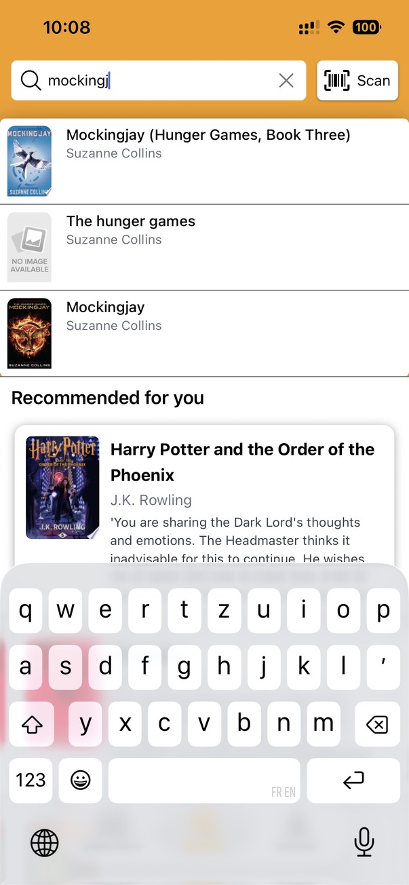

### Scanning

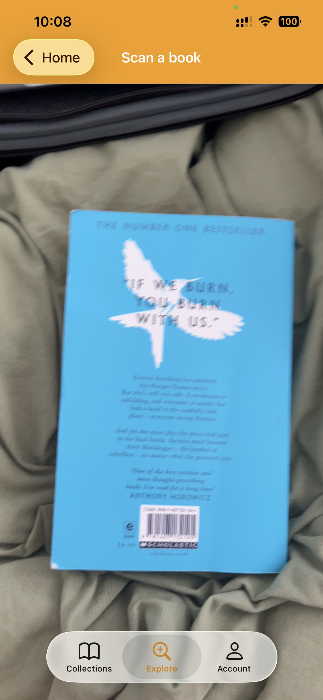

### Search Results

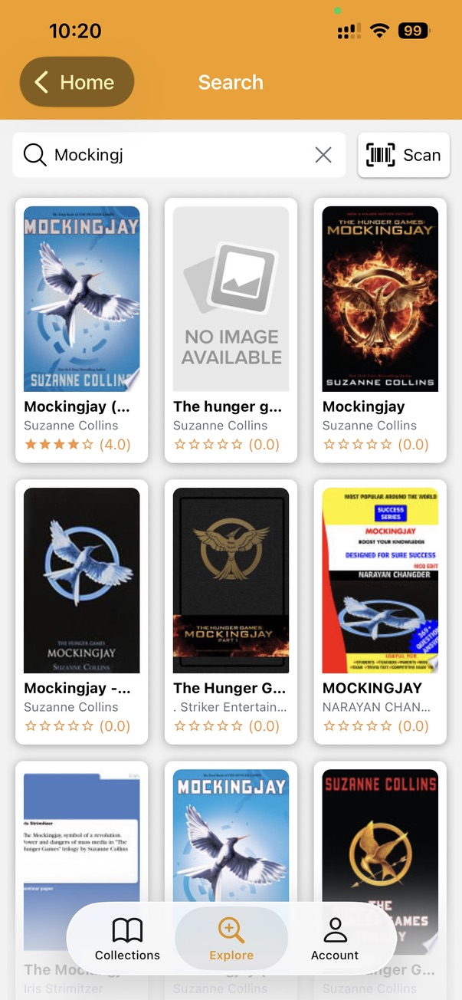

### Book Page & Details

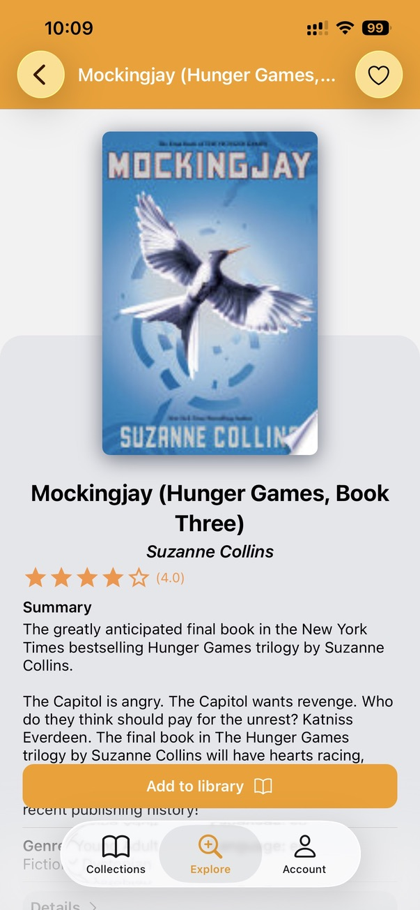  
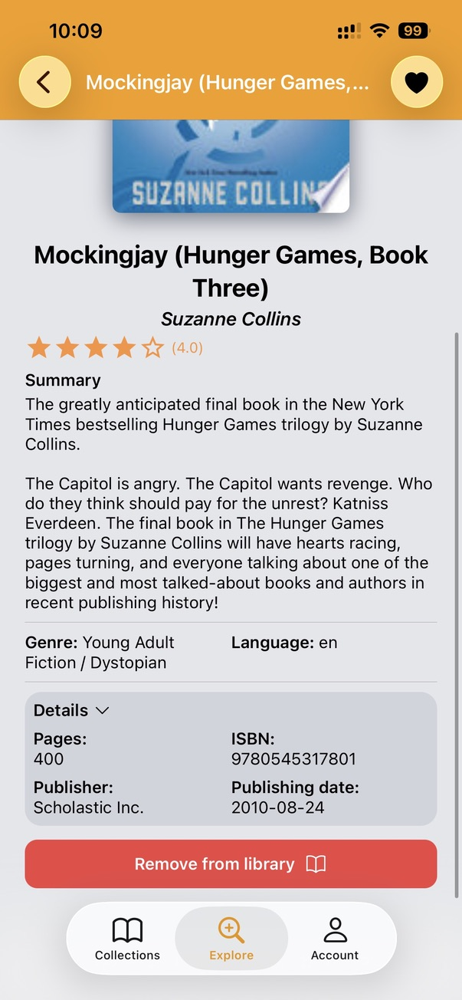

### Wishlist & Library Actions

Add to wishlist  

Add to library  
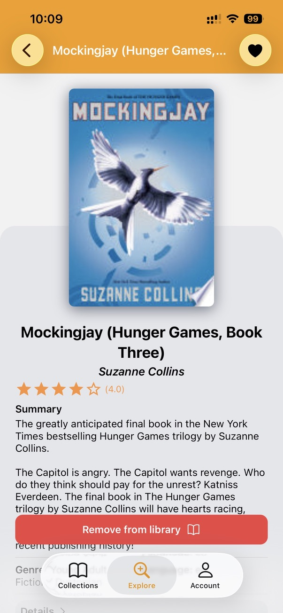

---

## License

MIT License
